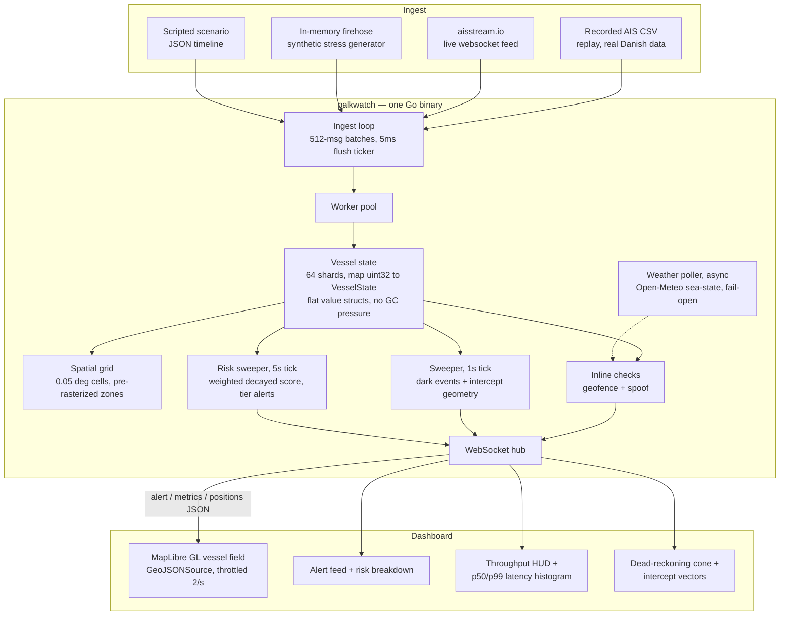

# Palk Watch

**Real-Time Dark-Vessel Detection and IUU Fishing Risk Engine**

Single Go Binary | Offline, No Cloud | 50,000+ msgs/sec Floor | Millisecond Inline Alerts

> **AWS-free by design.** Memory is the database. Built for a 24-hour hackathon, staged in Danish waters (Kattegat / Great Belt).

**Benchmark (measured, `make bench`, real Danish AIS, 60s sustained):**

| msgs/sec | vs 50k floor | dropped | inline p50 | inline p99 | dark sweep |
|---|---|---|---|---|---|
| **8,681,066** | **~174x** | **0** | **768 us** | **3,072 us** | 1s tick |

Full methodology and run history: [`docs/BENCH_LOG.md`](docs/BENCH_LOG.md).

---

## The Problem

Incumbent maritime surveillance (Global Fishing Watch, Skylight) is built for global, historical observation, not tactical, real-time action.

| Gap | Reality |
|---|---|
| Dark-ship blindspot | Vessels that switch off AIS to fish illegally take hours to surface on satellite fallback |
| Spoofing | Cheap hardware lets a vessel fake its position or claim impossible speed, undetected |
| Cloud dependency | Incumbent platforms are hosted services: no sovereignty, no offline mode, no local intercept math |
| Estimated cost of IUU fishing | USD 10-23 billion/year globally (UN / industry estimates) |

## The Solution

A hyper-optimized single-binary Go stream engine paired with a React + MapLibre GL dashboard. Runs entirely on a laptop a coast guard station already owns, no internet, no cloud database, and sustains millions of AIS messages per second.

> "Everyone alerts when a ship enters a zone. The crime happens when a ship disappears. We alert on absence in milliseconds, compute the intercept, and run on hardware a coast guard station already owns."

### Core Innovation: Three Real-Time Alerts + Explainable Risk Score

| Alert | Trigger | Runs | Severity |
|---|---|---|---|
| **ZONE_VIOLATION** | Outside-to-inside transition of a restricted zone, or EEZ cross by a foreign-flagged vessel | Inline, per message | HIGH |
| **SPOOF_TELEPORT** | Implied speed > 60 kn between fixes, or duplicate MMSI > 50 nm apart within 60s | Inline, per message | HIGH |
| **DARK_EVENT** | Silence > 6x (synthetic) / 10x (live) expected report interval, last speed > 1 kn, within 5 nm of a zone | Sweeper, 1s tick | CRITICAL |

Every DARK_EVENT carries a dead-reckoning cone (origin, heading, spread, scalar radius r(t)) and an intercept solution (heading, ETA, feasible flag) per configured patrol asset. The cone is a scalar on the wire; MapLibre draws the polygon client-side.

**IUU Fishing Risk Score.** Every vessel carries an explainable 0-100 suspicion score, time-decayed (24h half-life, 48h window), recomputed on a 5-second sweep over only vessels carrying a factor:

| Factor | Weight |
|---|---|
| Protected-zone violation | +30 |
| Dark event | +15 first, +10 each additional |
| Position spoof / teleport | +15 |
| Fishing-movement pattern (trawl / longline / seine) | +20 |

Tiers: **0-39 LOW, 40-64 ELEVATED, 65-84 HIGH, 85+ CRITICAL.** No black-box model: every point traces to a named, timestamped, on-map event. The engine never outputs "illegal: yes/no" — it ranks suspicion with visible evidence so the scarce patrol boat boards the highest-evidence vessel first. Authorities verify; we prioritize.

## Architecture



### Deliberate Architectural Decisions

| Decision | Choice | Why Not the Alternative |
|---|---|---|
| Persistence | In-memory only, optional JSON export | Postgres/Redis add a network hop and an ops burden; the pitch is memory-is-the-database sovereignty |
| Messaging | Go channels, 512-msg batches, mandatory 5ms flush ticker | Kafka/Flink/Spark are distributed-systems weight for a single laptop process; the ticker bounds worst-case latency without a broker |
| Hot-path state | `map[uint32]VesselState`, 64 shards, flat numeric fields only | Pointer-heavy or string-bearing structs pull the GC into the hot path; names/metadata live in a cold map touched only on alert emission |
| Distance math | Flat-plane equirectangular projection, one shared `geo/` helper | Haversine/GIS libraries are unnecessary trig cost at strait-and-belt scale; banned from the hot path by rule |
| Risk scoring | Hand-weighted, decayed, explainable factors | An ML classifier trades an auditable "why" for an unverifiable accuracy percentage; every point here traces to a timestamped event |
| Notification | Dashboard websocket only | SMS/email/webhook routing is a distraction from the core detection claim in a 24h build; cut with honor |
| Deployment | `go run`, one binary, no container | Docker/nginx/CI adds packaging work that doesn't change what's demoed on stage |

## The Numbers (measured, not aspirational)

Machine: Windows dev laptop, 8 CPUs, Go 1.26.5.

| Metric | Number |
|---|---|
| Required throughput floor | 50,000 msgs/sec |
| Real Danish AIS throughput (`make bench`) | 8,681,066 msgs/sec, 2,396 vessels, ~174x the floor |
| Dropped messages | 0, at both rates |
| Inline alert latency (zone, spoof) | p50 768 us, p99 3,072 us |
| Dark-event detection | 1s sweep plus the silence threshold (never claimed as millisecond) |
| Risk-score sweep | 5s tick, off the per-message hot path |

Full run history with commit hashes: [`docs/BENCH_LOG.md`](docs/BENCH_LOG.md). Pitch deck and Q&A: [`docs/pitch/`](docs/pitch/).

## Tech Stack (dependency freeze — nothing added without explicit approval)

| Layer | Dependency | Role |
|---|---|---|
| Engine | Go stdlib | Ingest loop, worker pool, HTTP |
| Engine | `gorilla/websocket` | Dashboard websocket hub |
| Engine | `paulmach/orb` | Zone polygon / point-in-polygon at startup rasterization |
| Engine | `rs/zerolog` | Boundary logging only (alerts, errors, lifecycle — never per message) |
| Engine | `stretchr/testify` | Table-driven tests in `check/` and `geo/` |
| Frontend | `react` | Dashboard UI |
| Frontend | `maplibre-gl` | Offline map rendering, GeoJSONSource vessel field |
| Frontend | `vite` | Dev server / build |

## Quick Start

### Run the engine

```bash
cd engine
```

| Command | What it does |
|---|---|
| `make run` | DEMO: recorded Danish AIS replay (real data, offline, reproducible) |
| `make demo-fast` | Same replay at 300x speed, pushes real data above the 50k/s floor |
| `make scenario-dk` | Scripted story: zone, spoof, trawl pattern, dark + intercept, risk score climb |
| `make firehose` | In-memory stress feed: the 50k+ throughput theatre |
| `make live` | LIVE aisstream.io feed (needs `APIKey=...` in `engine/.env`, never committed) |
| `make emit-fake` | Schema-valid alerts + metrics + positions, no engine (frontend dev) |
| `make bench` | **60s sustained throughput + latency benchmark, real Danish AIS** |
| `make bench-firehose` | Same benchmark, synthetic firehose headroom number |
| `make test` | Table-driven tests (`check/` and `geo/`) |

Add `-risk` to any run mode for the IUU risk-scoring engine (tier alerts, score breakdown on the wire); add `-weather` for the optional Open-Meteo sea-state confidence layer (async, fail-open, off the hot path).

### Run the dashboard

```bash
cd dashboard
npm install
npm run dev        # http://localhost:5173, talks to the engine on :8080
```

Start the engine first, then open the dashboard. It renders the vessel field, zones, the alert feed, the risk-score breakdown drawer, the throughput HUD, the inline/sweep latency histogram, and the dead-reckoning cone plus intercept vectors on dark events.

The engine speaks three websocket message types — `alert`, `metrics`, `positions` (a throttled GeoJSON FeatureCollection, max 2/sec) — and serves `/zones` and `/patrols` over REST for the map.

## Project Structure

```
engine/
  cmd/palkwatch/        Main binary: flags select ingest mode (csv, live, firehose, scenario, fake)
  cmd/bench/             Standalone 60s benchmark harness
  internal/ingest/       Batch channel pipeline, 5ms mandatory flush ticker
  internal/state/        Sharded vessel state (value structs, no pointers)
  internal/geo/           Flat-plane projection, dead-reckoning, intercept math
  internal/check/         Inline geofence + spoof checks, weather-confidence
  internal/alert/          Alert construction, sync.Pool reuse
  internal/risk/            Weighted decayed IUU suspicion score + tier sweeper
  internal/weather/         Async Open-Meteo sea-state poller (optional, fail-open)
  internal/api/              WebSocket hub
  internal/gen/               Firehose / scenario / aisdk-replay / live generators
  data/                         Zones (GeoJSON), scenarios, patrol configs
dashboard/
  src/map/                  MapLibre vessel layer, cone rendering
  src/panels/                 Alert feed, HUD, latency histogram, vessel details
docs/
  BENCH_LOG.md               Every hot-path change's measured number, with commit hash
  pitch/                      Slide deck, demo script, Q&A, latency-honesty note
```

## Scope Discipline

Cut with honor, specified but not built: rendezvous/transshipment detection (PRD Appendix A), any notification path beyond the dashboard (no SMS/email/webhooks), persistence beyond in-memory plus optional JSON export, ML fishing-behavior classification. Three alert types that work beat five that half-work.

Full constraints, hot-path rules, and the self-review protocol live in [`CLAUDE.MD`](CLAUDE.MD).

## Impact

| Outcome | How |
|---|---|
| Sovereign by construction | Runs offline on hardware a station already owns; no data leaves the building |
| Hours to seconds | Converts "we found out hours later" into "we knew the moment it went dark, and the patrol had a heading" |
| Fewer wasted patrol sorties | The explainable score sends the scarce boat to the highest-evidence vessel first |

## License

MIT
